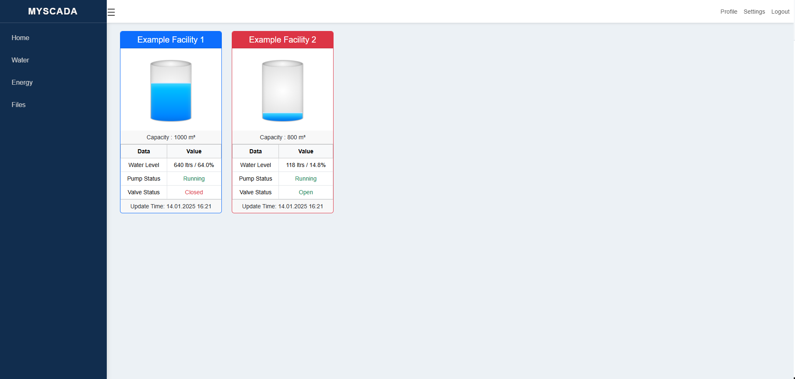

# Real-Time Water Tank Monitoring Dashboard

A dynamic and responsive web application that provides a real-time monitoring interface for water tanks. This project allows you to visualize tank water levels, pump statuses, valve statuses, and other related data in a clean and modern dashboard.

---

## Features

### Real-Time Data Updates:
- Displays tank water levels dynamically, including capacity and percentage filled.
- Simulated live updates for water levels, pump statuses, and valve statuses every 5 seconds.

### Dynamic Visualization:
- Cylinder-style 3D water tank representation with real-time water level adjustments.
- Card border colors change dynamically based on water level percentage:
  - **Red**: Less than 25% filled.
  - **Yellow**: 25%–50% filled.
  - **Blue**: 50%–75% filled.
  - **Green**: Above 75% filled.

### Fully Configurable:
- Easily map incoming JSON data to dashboard elements using a flexible mapping configuration.
- Supports different data formats and structures without modifying the core logic.

### Responsive Design:
- Built using **Bootstrap 5.3.3** for a mobile-friendly and modern interface.

---

## How It Works

### Mock Data:
- The dashboard uses simulated JSON data to emulate server-side data feeds.
- Example data includes tank capacity, current water level, pump status, valve status, and last update time.

### Dynamic Rendering:
- Data is processed and rendered into cards with cylinders representing tank levels.
- Percentages and tank statuses are updated dynamically based on the mock data.

### Customization:
- Update the `fieldMappings` in the JavaScript file to match incoming JSON keys to specific UI elements.
- Adapt the logic for real-world APIs with minimal effort.

---

## Technology Stack

### Frontend:
- **HTML5, CSS3, Bootstrap 5.3.3** for responsive design and layout.

### JavaScript:
- Dynamic rendering and real-time updates with vanilla JavaScript.

### Simulation:
- Mock data with a simulated data update interval.

---

### Screenshot:




I will share example screenshots from my previous project. I had developed a similar application in the past, and it was successfully used for a long time with great reliability.


## How to Run

1. Clone the repository:
   ```bash
   git clone https://github.com/your-username/water-tank-monitoring.git

   ## Contact

For questions, feedback, or support, feel free to reach out via email:

📧 **Email**: [burhancakmaks@gmail.com](mailto:burhancakmaks@gmail.com)


